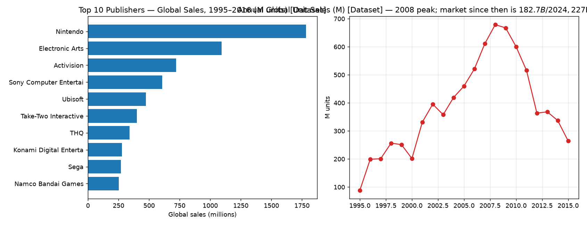

# Market Intelligence Agent — Amazon QuickSuite

A no-code market-intelligence workflow on Amazon QuickSuite: a Kaggle dataset as agent knowledge, a citation-enforced chat agent, a Quick Research deep-research brief of the live market, and a **validated** leadership brief — every insight tagged `[Dataset]` or `[Quick Research]` and re-checked against the raw CSV before acceptance.

*Udacity nd2726 Project 2 · Amazon QuickSuite (Spaces · Chat agents · Quick Research) · September 2026 · Wisdom Azaglo*

## The question and the answer

**Question (for a mid-size game publisher's FY2027 plan):** keep optimizing premium console/PC unit sales, or pivot investment to recurring monetization, mobile/PC platforms, and Asia-Pacific?

**Answer:** the market never shrank — the accounting model changed. Historical tracked unit sales fell ~90% from the 2008 peak while the market grew to **$182.7B (2024) → ~$227B (2028E)**; growth is mobile (~55%/$108B) + PC (+10.4% YoY); consolidation (Microsoft–Activision $68.7B, Take-Two–Zynga $12.7B) is squeezing the mid tier; geographic gravity is APAC. Overall confidence: **Medium-High** — directions corroborated by two independent evidence bases, magnitudes dependent on external aggregates.

| # | Insight | Sources | Confidence |
|---|---|---|---|
| 1 | Market transformed, not shrunk: 678.9M units (2008) → $182.7B/yr revenue | Dataset + Research | High |
| 2 | Consolidation squeezes mid-tier (top-5 held 52.7% even pre-mergers; THQ precedent) | Dataset + Research | High · Medium (EA figure) |
| 3 | Mobile + PC are the growth vectors; dataset era was 72.6% console | Dataset + Research | High/Medium |
| 4 | Gravity shifted to APAC (NA 51.4%→47.6% in-data; APAC-largest today) | Dataset + Research | Medium |
| 5 | GenAI could halve $200–400M AAA budgets — culturally contested | Research only | Low-Medium |

## Start here

1. [`Research_Brief_WA_Market_Intelligence.docx`](Research_Brief_WA_Market_Intelligence.docx) — the graded deliverable (objective, scope, approach, 5 insights, visual evidence, confidence, limitations, strategy, 7-sentence exec summary)
2. [`artifacts/04_reliability_evaluation.md`](artifacts/04_reliability_evaluation.md) — my Step-6 validation: per-insight confidence, freshness notes, "what would change our mind", impact/effort matrix
3. [`docs/limitations_and_checks.md`](docs/limitations_and_checks.md) — every dataset claim recomputed from the raw CSV, and the four conclusions I explicitly refused to draw
4. [`docs/methodology.md`](docs/methodology.md) — why the agent has six operating rules and why research ran as a separate job

## The build

| Asset | Name / ID |
|---|---|
| Space | `WA - Market Intelligence – Video Game Publishing` — dataset + 4 analysis artifacts, all Ready (`25cc817f`) |
| Knowledge | Kaggle [`gregorut/videogamesales`](https://www.kaggle.com/datasets/gregorut/videogamesales) — 16,598 titles, 1995–2016 (`data/vgsales.csv`) |
| Chat agent | `WA - Market Intelligence Agent – VG Publishing` — purpose + rules: source-tag every claim, confidence per insight, fixed section skeletons, flag timeliness gaps (`c46b71b2`) |
| Quick Research | `Global Video Game Publishing Market Intelligence 2024–2026` — plan-approval flow, ~9 min run (`e7c70710`); full text in [`artifacts/05_quick_research_report.txt`](artifacts/05_quick_research_report.txt) |
| Conversations | ① dataset analysis → ② integrated analysis (external findings injected as a labelled block, agreement/divergence demanded) → ③ leadership brief |

Workflow: dataset first (verifiable quantitative baseline) → external deep research scoped to four decision-critical unknowns → agent integration → my manual re-validation → brief. Full reasoning: [`docs/methodology.md`](docs/methodology.md).

## Evidence

21 screenshots in [`screenshots/`](screenshots) follow build order: portal (`600–602`) → Space + upload (`620–624`) → agent creation & knowledge link (`642–662`) → Quick Research (`664–673`) → agent analyses and brief (`674–678`) → organized Space (`679–680`). Each rubric criterion maps to a specific file in [`docs/rubric_map.md`](docs/rubric_map.md).



## Verify it yourself

```bash
python - <<'EOF'
import csv
from collections import defaultdict
rows=list(csv.DictReader(open('data/vgsales.csv')))
pub=defaultdict(float)
for r in rows: pub[r['Publisher']]+=float(r['Global_Sales'])
print(sorted(pub.items(), key=lambda x:-x[1])[:3])   # Nintendo 1786.56M, EA 1110M...
EOF
```

## Known weaknesses

Agent drafted all three analytic artifacts (mitigated: I recomputed the numbers, and the reliability doc is human-written); the research report entered the conversation via prompt rather than linked knowledge; the 10-year temporal gap between dataset and today is the project's largest structural weakness. [`docs/limitations_and_checks.md`](docs/limitations_and_checks.md).

## Contributing & license

Found a factual error or a better integration/validation approach? Open an issue — see [`CONTRIBUTING.md`](CONTRIBUTING.md) for the reproduction commands. Content licensed CC BY-NC-ND 4.0 ([`LICENSE`](LICENSE)).
